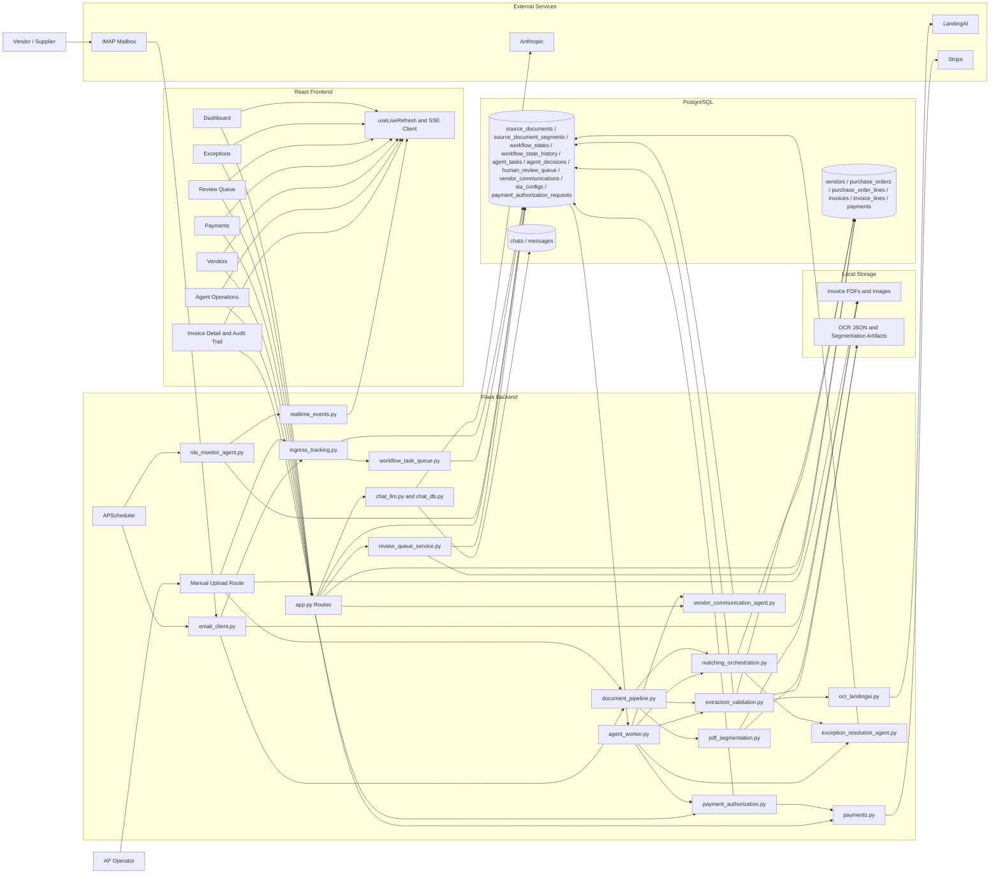

# TMC-v1
## Agentic Accounts Payable Application

TMC-v1 is an accounts payable application built around an agentic workflow model for document intake, invoice extraction, validation, matching, exception handling, vendor outreach, and payment authorization.

The current OCR and document extraction layer uses LandingAI.

Everything else in the application is structured around what happens before extraction, what happens after extraction, how decisions are persisted, how human review is inserted when needed, and how the operational UI stays current without requiring manual refresh.

This document describes the application as it exists now.

## Table of Contents

1. What the Application Is
2. What Makes It Agentic
3. Core Business Problem
4. Product Gallery
5. End-to-End Lifecycle
6. Agentic Architecture
7. Detailed Backend Components
8. Detailed Frontend Components
9. Data Model
10. Workflow and Status Model
11. Realtime Update Model
12. Duplicate Prevention Model
13. Human Review and Safety Controls
14. API Surface
15. Configuration
16. Local Run and Operations
17. Project Structure
18. Design Principles
19. Summary of Implemented Fixes

## 1. What the Application Is

TMC-v1 is an operational system for processing vendor invoices from the moment they enter the business until the point they are either:

- matched and moved toward payment,
- routed into review,
- used to draft a vendor clarification,
- or blocked because the document is a duplicate or unsafe to process.

The application has four major layers:

- A Flask backend that owns workflow orchestration, APIs, payment execution, vendor communication planning, and chat endpoints.
- A PostgreSQL database that stores business records and agent workflow state.
- A React frontend that acts as the live operations console.
- An OCR and document extraction layer that turns invoice files into structured JSON.

The application is no longer just a deterministic OCR pipeline with a dashboard attached. It now has a durable workflow backbone:

- source document registration,
- task queueing,
- workflow state transitions,
- state history,
- agent decisions,
- human review queues,
- vendor communication drafts,
- payment authorization records,
- and live status propagation to the frontend.

That is what turns it into an agentic application rather than only a traditional workflow application.

## 2. What Makes It Agentic

This application is agentic because major business steps are represented as explicit units of work with persisted state, decision records, and review gates.

The agentic properties are:

- Documents are registered as first-class workflow entities before they become invoices.
- The system persists task state in a durable queue instead of relying only on in-memory control flow.
- Decision points write structured decision records rather than only logs.
- Human review is modeled as a real queue with statuses and reasons.
- Vendor communication is planned as a tracked workflow with approval before outbound action.
- Payment authorization is evaluated as a tracked workflow with approval before execution.
- Realtime events keep the UI synchronized with backend state so operators are looking at current information instead of stale snapshots.

Just as important, this is a constrained agentic system. It does not hand critical control to a free-form LLM planner.

The system keeps:

- deterministic persistence,
- deterministic matching rules,
- explicit approvals,
- state history,
- and auditability

while using agent-like workflow decomposition where it adds operational value.

## 3. Core Business Problem

Accounts payable teams deal with three recurring problems:

- invoices arrive through inconsistent channels and formats,
- extracted data must be checked against vendor and purchase order records,
- and payment must not happen until the invoice is both valid and safe.

The failure modes are expensive:

- the wrong invoice is paid,
- the same invoice is paid twice,
- a fraudulent invoice enters the queue,
- an exception gets stuck without visibility,
- or the UI shows stale status and operators act on outdated information.

TMC-v1 addresses those problems by combining:

- document ingestion,
- OCR and document extraction,
- invoice validation,
- duplicate blocking,
- purchase order matching,
- review routing,
- approval-gated vendor outreach,
- approval-gated payment authorization,
- and realtime operational visibility.

## 4. Product Gallery

### Dashboard Overview

The dashboard is the operations landing page. It shows system activity, recent invoices, and live operational status.


### Vendors

The vendor page is the vendor control surface. It shows vendor records, vendor-level context, invoice activity, purchase orders, and vendor-scoped chat.


### Invoice - As a PDF

This is the raw input document form the system receives. The application treats the original file as an auditable source artifact.


### Invoice - Post OCR

This is the structured result after OCR and document extraction. The application uses this JSON as the basis for validation, duplicate checks, database persistence, and PO matching.


### AgentOps Dashboard
A dashboard to track Agent Activity, Agent Health, Invoice Processing Metrics and SLA Health


### Chat Interface

The vendor-specific chat interface provides a scoped assistant for working with vendor, invoice, and PO context. It is part of the operational surface, not the workflow orchestrator.


### Exception Invoices

The exceptions page groups invoices that could not be processed cleanly. These are the records most likely to require operator review or vendor clarification.


### Review Queue

Invoices that are did not meet confidence threshold or those that met partial threshold are sent to review queqe with explanation as to why they are marked as "Needs to be Reviewed".


### Payments

The payments page is the payable-invoice interface. It now operates with stronger duplicate and payment-state protections and is kept current through live backend updates.


## 5. End-to-End Lifecycle

This section describes the application from the moment a document enters the system to the moment the invoice is paid, reviewed, blocked, or escalated.

### Step 1: Document Ingress

An inbound document enters through one of two channels:

- email attachment intake,
- or manual upload.

Email attachments are fetched by the IMAP polling flow in `email_client.py`.

Manual uploads are received through the `/upload` path in `app.py`.

In both cases the file is saved to local storage and immediately registered as a `source_document`.

That source document record includes:

- source type,
- storage path,
- original filename,
- file hash,
- content type,
- optional email metadata,
- vendor reference if known,
- and workflow-oriented status fields.

This is the first point where the application departs from a simple file-processing pipeline. The system now treats the inbound file itself as a durable tracked entity.

### Step 2: Source Document Registration

After the file lands on disk, the ingress tracking layer records it in `source_documents`.

This registration step also:

- creates the initial workflow state,
- writes ingress metadata,
- and enqueues an `intake.classify` task for the worker.

The application can still continue its synchronous path immediately, but the source document and queue record now exist even before OCR begins.

### Step 3: Intake Classification

The agent worker claims `intake.classify` tasks from the durable `agent_tasks` queue.

The current classifier is deterministic:

- manual uploads are treated as explicit invoice candidates,
- email attachments are checked against invoice heuristics.

The result is persisted in:

- source document metadata,
- agent task result,
- and agent decision records.

This gives the application a proper intake classification stage with durable audit history instead of a transient decision hidden inside request-time code.

### Step 4: Intelligent PDF Separation

If the source file is a PDF, the system can decide whether it contains:

- one invoice across multiple pages,
- or multiple invoices packaged together.

The segmentation layer reads page-level text, looks for invoice boundary signals, and only creates child documents when confidence is high enough.

Each detected child document becomes a `source_document_segment`.

This matters because the system no longer assumes:

- one file equals one invoice.

Instead, it assumes:

- one source document may produce one or more invoice candidates.

### Step 5: OCR and Document Extraction

Each segment, or the original document if there was no split, is sent to the OCR and document extraction layer.

In the current stack, this layer performs:

- document parsing,
- schema-based extraction,
- and structured JSON generation.

The application stores the parse and fields artifacts beside the original file.

### Step 6: Extraction Validation

Once the extraction layer returns structured JSON, the extraction validation layer evaluates it.

This layer checks:

- required fields,
- arithmetic consistency,
- invoice date and due date sanity,
- duplicate invoice candidates,
- and extraction readability.

The output of this stage is not just a pass or fail. It is a typed validation result with:

- issues,
- severities,
- extracted fields,
- duplicate candidates,
- review reason,
- and review item linkage when needed.

This makes the extraction stage agent-compatible because it produces structured reasoning output rather than only raw OCR text.

### Step 7: Duplicate Prevention Before Persistence

If validation finds a high-confidence duplicate, the invoice is blocked before it is inserted into the `invoices` table.

This is a critical safety control.

Without this step, the system could:

- ingest the same invoice again,
- match it again,
- and eventually make it payable twice.

The application now blocks that path before persistence.

### Step 8: Invoice Persistence

If the extracted document is not blocked, the system writes:

- one invoice record into `invoices`,
- and one or more line-item records into `invoice_lines`.

At this point the invoice becomes part of the structured AP dataset used by:

- the dashboard,
- the exceptions page,
- the vendor page,
- the payment page,
- and downstream agents.

### Step 9: Purchase Order Matching

Immediately after persistence, the matching orchestration layer evaluates the invoice against purchase orders.

The current matching engine is deterministic and based on:

- PO number,
- vendor identity,
- currency,
- and total amount tolerances.

The orchestration layer does more than produce a simple match result. It also:

- sets invoice workflow state,
- creates agent task and decision records,
- and pushes unmatched or ambiguous cases into the human review queue.

### Step 10: Exception and Review Routing

If matching cannot complete safely, the invoice is not left as an unstructured failure.

The system creates:

- a review item in `human_review_queue`,
- a workflow state transition,
- and a matching decision record.

This means exception handling is now part of the formal workflow backbone rather than only a frontend filter over invoice statuses.

### Step 11: Vendor Communication Planning

When the system needs external clarification, the vendor communication agent can prepare a draft message.

This process:

- reads invoice and vendor context,
- chooses a template based on the review reason,
- creates a draft communication record,
- creates a human review item,
- and marks the communication as pending approval.

The system does not auto-send vendor email. It only plans, stores, and tracks the draft until a human approves and manually marks it sent.

### Step 12: Payment Authorization

Payments now have an agentic authorization stage before execution.

The payment authorization agent:

- loads the invoice batch,
- verifies payment eligibility,
- evaluates risk signals,
- creates an authorization request,
- creates a decision record,
- and inserts the request into the review path.

Only after explicit approval can the system call the existing Stripe payment path.

### Step 13: Stripe Payment Execution

Once a payment authorization is approved, the system creates a Stripe PaymentIntent for the selected invoice batch.

The payment layer now also enforces duplicate safeguards:

- duplicate invoices already paid or already pending elsewhere are blocked,
- duplicate invoice selections in the same batch are blocked,
- and repeated create-intent retries reuse the same Stripe intent and local payment record safely.

### Step 14: Realtime UI Updates

As backend workflow transitions happen, the system emits live events.

The frontend subscribes through Server-Sent Events and refreshes the major operational views without requiring a manual page refresh.

This is the reason the dashboard, exceptions page, vendors page, and payments page can stay current during active processing.

## 6. Agentic Architecture

The agentic architecture is built from a few core ideas:

- every tracked business unit is represented as a durable entity,
- every major workflow step is represented as a state transition,
- every queued unit of work is represented as an agent task,
- every non-trivial decision is written as a decision record,
- and every ambiguous or high-risk action can be routed into explicit human review.

### 6.1 System Architecture Diagram



### 6.2 Core Execution Model

The application uses a hybrid model:

- deterministic business logic for validation, matching, and payment control,
- agent-style decomposition for workflow stages and approvals,
- and LLM assistance where read-heavy reasoning is useful.

This is important because AP operations require predictability and auditability. The application does not use an unconstrained LLM to make direct payment or vendor outreach decisions.

### 6.3 Specialist Agent Roles

The current system includes these specialist roles:

- Intake classifier
- Extraction and validation agent
- Matching agent
- Vendor communication planner
- Payment authorization agent
- Vendor chat assistant

Not all of these are LLM agents. Some are deterministic workflow agents. That is deliberate. The application treats "agent" as a persisted workflow participant, not necessarily "LLM for every step."

### 6.4 Shared Workflow Backbone

All of the specialist roles share the same workflow substrate:

- `source_documents`
- `source_document_segments`
- `workflow_states`
- `workflow_state_history`
- `agent_tasks`
- `agent_decisions`
- `human_review_queue`
- `vendor_communications`
- `sla_configs`
- `payment_authorization_requests`

This is what gives the application continuity across stages.

### 6.5 Why This Is Agentic-Native

The application is now agentic-native for three reasons:

1. Documents and downstream actions are modeled as tracked workflow entities.
2. Decisions and task runs are durable and queryable.
3. Human approval is part of the architecture, not a manual side process.

### 6.6 Agent Collaboration: A Concrete Walkthrough

This walkthrough shows a single invoice moving through the live system from ingress to payment authorization.

#### Step 1: Intake Agent classifies the document

An invoice arrives as an email attachment or manual upload.

The intake path saves the file, creates a `source_document`, records the initial workflow state, and enqueues an `intake.classify` task.

The intake agent evaluates the file as an invoice candidate and writes that classification result into:

- the task result,
- the source document record,
- and the `agent_decisions` table.

At this point the orchestrator does not need to guess what happened at ingress. It has a durable intake decision and a tracked source artifact.

#### Step 2: Extraction agent runs OCR and detects weak fields

The worker picks up the extraction-validation task for the document or segment and calls the OCR and document extraction layer.

The extractor returns structured JSON, but the extraction agent sees that some critical fields are weak. For example:

- the PO number confidence is low,
- the invoice total is readable but borderline,
- or the vendor tax ID is incomplete.

Instead of accepting that first pass silently, the extraction agent records the low-confidence condition and triggers a targeted re-extraction pass aimed at the weak fields only.

That retry is bounded:

- it uses the same extraction layer again,
- it is field-targeted,
- and it only happens once per invoice.

If the second pass improves confidence above threshold, the better values replace the weaker ones and the decision trail records both the original low-confidence assessment and the successful re-extraction.

#### Step 3: Matching agent attempts an exact PO match and fails

Once the invoice is validated, the matching agent takes over.

It runs the deterministic PO analysis against the current invoice fields, vendor, currency, and amount. In this scenario the invoice does not match a PO exactly. The extracted PO number is close, but not exact enough for a clean deterministic match.

The matching agent does not force a link. It records:

- the failed exact match,
- the candidate analysis it found,
- and the reason the invoice could not be auto-matched safely.

It then notifies the orchestrator by returning a structured unresolved result rather than escalating directly to a human.

#### Step 4: Exception resolution agent tries recovery paths and succeeds

The orchestrator hands the invoice to the exception resolution agent before any human review item is created.

Because this is a PO-related failure, the exception resolution agent runs its recovery loop:

1. It checks fuzzy similarity between the invoice PO reference and open POs for the confirmed vendor.
2. It compares the invoice total against the candidate PO totals.
3. It verifies that the string similarity and amount delta are both inside the configured acceptance bounds.

In this walkthrough the fuzzy PO path succeeds. The agent finds an open PO whose number is a near match and whose total is close enough to qualify. It auto-links the invoice to that PO, records the recovery attempt and outcome in `agent_decisions`, and hands the resolved invoice back to the orchestrator.

No human review item is created because the exception was recovered automatically and audibly.

#### Step 5: SLA monitor checks the invoice and keeps it in the OK window

During its scheduled run, the SLA monitor agent inspects invoices in active states.

It sees this invoice in its current workflow state, calculates the time spent in that state, compares that duration to the configured warning and breach thresholds, and determines that the invoice is still within the normal window.

The monitor leaves the `breach_risk` field at `ok`. No warning or breach event is emitted because nothing has crossed a threshold, but the invoice remains visible to the SLA subsystem as a tracked operational entity.

#### Step 6: Payment authorization agent evaluates the batch and routes it for approval

Later, this invoice enters a payment batch.

The payment authorization agent evaluates the batch using the live risk signals:

- total batch amount,
- invoice count,
- vendor payment history,
- and duplicate selection checks.

In this scenario the batch contains a vendor with no prior successful payment history in the system. Even if the amount and invoice count are modest, that vendor-history signal raises the batch to medium risk.

The payment authorization agent therefore does not auto-execute. It records the risk evaluation, writes a plain-English reasoning entry to `agent_decisions`, creates an authorization request, and routes the batch into the human approval queue.

#### Final outcome

The invoice made it through intake, extraction, validation, deterministic matching, automated exception recovery, SLA monitoring, and payment-risk evaluation.

The final result is:

- one human touchpoint at payment authorization,
- multiple agents collaborating across specialized stages,
- no unsafe forced match,
- no uncontrolled payment execution,
- and a full audit trail covering every handoff and decision.

## 7. Detailed Backend Components

## 7.1 `app.py`

`app.py` is the backend composition root.

It is responsible for:

- Flask app creation
- scheduler start
- HTML operator pages
- JSON API routes
- SSE stream route for live updates
- integration of payments, vendors, invoices, chat, agent operations, vendor communication, and payment authorization

It also centralizes user-facing API error handling so the frontend no longer receives raw technical exceptions for normal operator flows.

## 7.2 `email_client.py`

This module owns email intake.

Its responsibilities are:

- IMAP connection
- mailbox search
- sender filtering
- attachment extraction
- invoice-file detection
- storage handoff
- and invocation of the shared document pipeline

It is the automated ingress path for supplier invoices arriving by email.

## 7.3 `storage_local.py`

This is the local storage adapter.

It:

- sanitizes paths for filesystem safety,
- places files under date- and source-based directories,
- and treats repeated writes to the exact same path as duplicates.

It preserves the original file as a stable audit artifact.

## 7.4 `ingress_tracking.py`

This module turns raw file ingress into tracked source-document state.

It computes:

- file hash,
- file size,
- content type,
- and initial metadata.

It then records the source document and enqueues the intake classification task.

This is the first agentic layer in the file lifecycle.

## 7.5 `agent_db.py`

This is the central data-access layer for agent workflow primitives.

It provides:

- source document write and read operations,
- segment write and update operations,
- workflow state write and history,
- task enqueue, lease, run, complete, fail, and heartbeat primitives,
- decision logging,
- review queue write and read,
- vendor communication persistence,
- SLA reads,
- and operational overview queries.

This file is the workflow spine of the agentic system.

## 7.6 `agent_worker.py`

This module runs the durable task consumer.

It:

- claims tasks using leases,
- marks them running,
- executes registered handlers,
- completes or fails tasks,
- and records decisions through shared DB operations.

The currently active handler is the intake classifier, but the worker model is the runtime foundation for additional agent tasks.

## 7.7 `pdf_segmentation.py`

This module handles multi-invoice PDF detection and splitting.

Its output is both filesystem artifacts and structured segmentation metadata.

It supports the core premise that one source document may generate several invoices.

## 7.8 `ocr_landingai.py`

This module is the OCR and document extraction adapter.

It is responsible for:

- parse invocation,
- extract invocation,
- schema bridging,
- and JSON artifact generation.

## 7.9 `extraction_validation.py`

This module wraps OCR output with operational validation logic.

It performs:

- required-field checks,
- arithmetic validation,
- date sanity checks,
- duplicate candidate lookup,
- review item creation,
- and source-document segment status updates.

This is the first place where extracted data becomes an operationally meaningful decision instead of only raw extraction output.

## 7.10 `document_pipeline.py`

This is the shared document execution path after a file is saved.

It orchestrates:

- segmentation,
- segment tracking,
- extraction,
- duplicate blocking,
- persistence,
- matching,
- and source-document extraction finalization.

It also publishes live events so the UI can react immediately.

## 7.11 `invoice_db.py`

This module does two classes of work:

- transactional invoice persistence,
- and read/query operations for dashboards and UI pages.

It now also participates directly in duplicate safety by:

- checking strong duplicates before persistence,
- and filtering duplicate copies out of the payable list.

## 7.12 `po_matching.py`

This is the deterministic PO matcher.

It evaluates invoice-to-PO compatibility using:

- PO number
- vendor
- currency
- total amount
- tolerance windows

It does not rely on an LLM.

## 7.13 `matching_orchestration.py`

This wraps the matcher and turns the result into workflow operations.

It:

- updates invoice match outcome,
- sets workflow state,
- creates review items when needed,
- and records agent task and decision history.

This is the matching-stage agent layer.

## 7.14 `vendor_communication_agent.py`

This module plans vendor clarification drafts.

It:

- loads invoice and vendor context,
- chooses a reason-specific communication template,
- creates a communication record,
- creates a review item,
- writes workflow state,
- and requires explicit approval before the communication can be treated as sent.

It is a planning and approval workflow, not an outbound mail delivery engine.

## 7.15 `payment_authorization.py`

This module evaluates payment batches before Stripe execution.

It:

- loads invoice context,
- evaluates eligibility,
- computes simple risk signals,
- creates an authorization request,
- records agent decisions,
- requires human approval,
- and only then allows payment execution.

This is the control layer between "invoice is payable" and "money is actually sent."

## 7.16 `payment_authorization_db.py`

This stores and loads payment authorization requests and their lifecycle fields.

It is the persistence layer for authorization-stage payment control.

## 7.17 `payments.py`

This module owns the actual payment flow.

It:

- validates invoice eligibility,
- creates or reuses Stripe intents safely,
- upserts payment records,
- blocks duplicate-payment scenarios,
- handles retry-safe idempotency,
- marks invoices paid,
- and reverts invoice statuses when a payment is canceled or fails.

This is where the financial safety checks become enforced actions.

## 7.18 `realtime_events.py`

This module provides the live event bus for the application.

It:

- tracks subscribers,
- emits revisioned events,
- streams heartbeats,
- and supports the frontend’s live operational refresh behavior.

This is the backend piece that removes the need for manual page refresh.

## 7.19 `user_facing_errors.py`

This module translates backend exceptions into operator-facing API messages.

It makes common AP problems understandable:

- duplicate invoices,
- payment already pending,
- invoice already paid,
- missing required input,
- service connectivity issues,
- and system configuration problems.

## 7.20 `chat_db.py` and `chat_llm.py`

These files power the vendor-scoped assistant.

They provide:

- chat persistence,
- message history,
- vendor-scoped context shaping,
- Claude interaction,
- streaming responses,
- and chat title generation.

This assistant is operationally useful but separate from the core agent workflow runtime.

## 8. Detailed Frontend Components

## 8.1 `frontend/src/services/api.js`

This is the frontend API layer.

It now handles:

- user-friendly error mapping,
- normal JSON fetches,
- payment endpoints,
- agent endpoints,
- and live SSE subscription setup.

It is the single point where network failures and API failures are normalized before reaching the pages.

## 8.2 `frontend/src/lib/useLiveRefresh.js`

This hook binds the frontend to the SSE live stream.

It:

- opens the stream,
- receives change events and heartbeats,
- triggers background refreshes,
- avoids duplicate in-flight refreshes,
- and refreshes again when the tab becomes visible.

This hook is the client-side reason the application stays current without manual refresh.

## 8.3 `Dashboard.jsx`

The dashboard is the operations landing page.

It shows:

- throughput metrics,
- graph data,
- recent invoices,
- run-now progress,
- upload progress,
- and live connection status.

It now refreshes from the live event stream instead of relying on explicit page reloads.

## 8.4 `Exceptions.jsx`

The exceptions page groups invoices requiring attention and refreshes live as new review-worthy invoices enter the system.

## 8.5 `Vendors.jsx`

The vendors page is a combined vendor master data page and vendor operations page.

It supports:

- vendor list,
- vendor detail,
- invoice and PO drilldown,
- create and delete actions,
- and vendor chat.

It now also refreshes live as vendor or invoice state changes.

## 8.6 `Payments.jsx`

The payments page shows payable invoices, payer entry, and Stripe payment execution.

It now:

- refreshes live,
- drops stale selections when invoices leave the payable set,
- and reflects payment state changes faster than before.

## 8.7 Remaining Shared Components

The rest of the frontend is built from:

- `Sidebar.jsx`
- `InvoiceDetailModal.jsx`
- `PurchaseOrderDetailModal.jsx`
- `VendorDetailPanel.jsx`
- `VendorTable.jsx`
- `LineChart.jsx`
- `VendorChat.jsx`

These components sit on top of the same backend model and give operators page-specific control over the underlying workflow state.

## 9. Data Model

## 9.1 Core AP Tables

The business data model includes:

- `vendors`
- `purchase_orders`
- `purchase_order_lines`
- `invoices`
- `invoice_lines`
- `payments`
- `payment_invoices`
- `chats`
- `chat_messages`

## 9.2 Agentic Workflow Tables

The workflow model includes:

- `source_documents`
- `source_document_segments`
- `workflow_states`
- `workflow_state_history`
- `agent_tasks`
- `agent_decisions`
- `human_review_queue`
- `vendor_communications`
- `sla_configs`
- `payment_authorization_requests`

## 9.3 Why the Data Model Matters

The difference between a normal workflow app and this application is largely visible in these tables.

The application does not only store business outcomes. It stores:

- state,
- reason,
- task lifecycle,
- human review,
- approval status,
- and decision metadata.

That is what gives the system durable operational memory.

## 10. Workflow and Status Model

### 10.1 Source Document Statuses

Source documents move through states such as:

- received
- classified
- segmented
- extracting
- validated
- needs_review
- extraction_failed

### 10.2 Segment Statuses

Segments can be:

- created
- extracting
- validated
- review_required
- persisted
- duplicate_blocked
- failed

### 10.3 Invoice Statuses

Invoice statuses in the application include:

- unmatched
- vendor_mismatch
- needs_review
- matched_auto
- ready_for_payment
- payment_pending
- paid
- duplicate_blocked

### 10.4 Communication Statuses

Vendor communication records use states such as:

- pending_approval
- approved
- rejected
- sent

### 10.5 Payment Authorization Statuses

Payment authorization records move through:

- pending_approval
- approved
- rejected
- payment_intent_created
- execution_failed

## 11. Realtime Update Model

The application uses Server-Sent Events for live operational updates.

This works well for the current product because:

- the frontend mostly needs one-way updates from backend to browser,
- the screens are operational dashboards rather than collaborative editors,
- and SSE integrates cleanly with existing Flask responses.

The live model consists of:

- a backend event publisher,
- an SSE stream route,
- a frontend subscription layer,
- and page-level refresh hooks.

The backend publishes events for key stages such as:

- source document segmentation,
- invoice persistence,
- duplicate blocking,
- match-state changes,
- payment intent creation,
- payment success,
- payment reversion,
- and inbox run start and finish.

The pages consume these events and quietly refresh themselves. This is why the UI can stay current without forcing the user to click Refresh.

## 12. Duplicate Prevention Model

Duplicate prevention is one of the most important controls in this system.

The application now defends against duplicates in several layers.

### 12.1 File-Level Duplicate Prevention

If the exact same file lands at the exact same storage path, the storage layer treats it as already uploaded.

### 12.2 Extraction-Level Duplicate Detection

After OCR and document extraction, the validation layer searches for existing invoices with matching invoice number and supporting signals such as:

- same vendor or supplier,
- same total amount,
- same invoice date.

High-confidence matches block persistence.

### 12.3 Payable-List Duplicate Protection

The payable invoice query excludes later duplicate copies so the operator does not see a duplicated payable set on the payment screen.

### 12.4 Payment-Time Duplicate Protection

Even if older duplicate records already exist in the database, the payment layer checks again and blocks payment when:

- the same invoice appears twice in the selected batch,
- or another copy of the same invoice is already paid or currently pending payment.

This means the application does not rely on a single duplicate check. It applies layered duplicate safety.

## 13. Human Review and Safety Controls

The application is built so that unsafe actions do not proceed by default.

### 13.1 Review-First Design

When the system cannot resolve an issue safely, it creates a review item rather than silently guessing.

Examples:

- duplicate extraction result,
- matching failure,
- vendor clarification requirement,
- payment authorization requirement.

### 13.2 Approval Gates

Two particularly sensitive workflows are approval-gated:

- vendor communication
- payment authorization

The system can prepare the record, but a human must approve before the workflow advances.

### 13.3 Auditability

Important actions are auditable through:

- workflow state history,
- task records,
- decision records,
- and review queue entries.

### 13.4 Friendly Errors for Operators

The API now returns user-facing errors instead of raw technical failures in common operator paths. This reduces the chance that a user misreads a transient backend or integration error as a business outcome.

## 14. API Surface

## 14.1 Dashboard and Operations

- `GET /api/dashboard/stats`
- `GET /api/dashboard/graph-data`
- `GET /api/run/status`
- `GET /api/live/stream`
- `POST /run-now`

## 14.2 Manual Upload

- `GET /upload`
- `POST /upload`

## 14.3 Invoice APIs

- `GET /api/invoices/recent`
- `GET /api/invoices/<invoice_id>`
- `GET /api/invoices/exceptions`
- `GET /api/invoices/payable`

## 14.4 Vendor APIs

- `GET /api/vendors`
- `GET /api/vendors/stats`
- `GET /api/vendors/<vendor_id>`
- `POST /api/vendors`
- `DELETE /api/vendors/<vendor_id>`
- `GET /api/vendors/<vendor_id>/mentions`

## 14.5 Purchase Order APIs

- `GET /api/purchase-orders/<po_id>`

## 14.6 Payment APIs

- `POST /api/payments/create-intent`
- `POST /api/payments/confirm`
- `POST /api/payments/cancel`

## 14.7 Agent Operations APIs

- `GET /api/agent/overview`
- `GET /api/agent/source-documents`
- `GET /api/agent/source-documents/<source_document_id>`
- `GET /api/agent/workflow-states`
- `GET /api/agent/workflow-history/<entity_type>/<entity_id>`
- `GET /api/agent/tasks`
- `GET /api/agent/decisions`
- `GET /api/agent/review-queue`
- `GET /api/agent/sla-configs`
- `GET /api/agent/sla-breaches`

## 14.8 Vendor Communication APIs

- `GET /api/agent/vendor-communications`
- `GET /api/agent/vendor-communications/<communication_id>`
- `POST /api/agent/vendor-communications/draft`
- `POST /api/agent/vendor-communications/<communication_id>/approve`
- `POST /api/agent/vendor-communications/<communication_id>/reject`
- `POST /api/agent/vendor-communications/<communication_id>/mark-sent`

## 14.9 Payment Authorization APIs

- `GET /api/agent/payments/authorizations`
- `GET /api/agent/payments/authorizations/<request_id>`
- `POST /api/agent/payments/authorize`
- `POST /api/agent/payments/authorizations/<request_id>/approve`
- `POST /api/agent/payments/authorizations/<request_id>/reject`
- `POST /api/agent/payments/authorizations/<request_id>/execute`

## 14.10 Vendor Chat APIs

- `POST /api/vendors/<vendor_id>/chat/start`
- `GET /api/vendors/<vendor_id>/chat`
- `GET /api/vendors/<vendor_id>/chat/<chat_id>/messages`
- `POST /api/vendors/<vendor_id>/chat/<chat_id>/messages`
- `GET /api/vendors/<vendor_id>/chat/<chat_id>/stream`
- `POST /api/vendors/<vendor_id>/chat/<chat_id>/stream`

## 15. Configuration

## 15.1 Backend Environment Variables

Common backend variables include:

- `DATABASE_URL`
- `FLASK_SECRET_KEY`
- `PORT`
- `CHECK_INTERVAL_SECONDS`
- `LOCAL_INVOICE_DIR`
- `IMAP_HOST`
- `IMAP_PORT`
- `EMAIL_USERNAME`
- `EMAIL_PASSWORD`
- `TARGET_SENDERS`
- `VISION_AGENT_API_KEY`
- `ADE_MODEL`
- `ADE_ENVIRONMENT`
- `ENABLE_AGENT_WORKER`
- `AGENT_WORKER_POLL_INTERVAL_SECONDS`
- `AGENT_WORKER_LEASE_SECONDS`
- `AGENT_WORKER_RETRY_DELAY_SECONDS`
- `PDF_SEGMENTATION_MIN_CONFIDENCE`
- `PDF_SEGMENTATION_MIN_TEXT_CHARS`
- `EXTRACTION_VALIDATION_TOTAL_TOLERANCE`
- `STRIPE_SECRET_KEY`
- `ANTHROPIC_API_KEY`
- `CLAUDE_MODEL`
- `PAYMENT_AUTH_MEDIUM_RISK_TOTAL`
- `PAYMENT_AUTH_HIGH_RISK_TOTAL`
- `PAYMENT_AUTH_MEDIUM_RISK_INVOICE_COUNT`
- `PAYMENT_AUTH_HIGH_RISK_INVOICE_COUNT`

## 15.2 Frontend Environment Variables

- `REACT_APP_API_URL`
- `REACT_APP_STRIPE_PUBLISHABLE_KEY`

## 16. Local Run and Operations

## 16.1 Backend

```powershell
python app.py
```

## 16.2 Frontend

```powershell
cd frontend
npm start
```

## 16.3 Database

The application expects PostgreSQL-compatible schema support and uses SQL migrations stored in the `migrations/` directory.

## 16.4 Operator Behavior

With the current live event model:

- dashboard metrics update without manual refresh,
- exception queues update without manual refresh,
- vendor and payment views refresh in place,
- and payment state changes propagate back to the UI faster than before.

## 17. Project Structure

```text
tmc-v1/
|-- app.py
|-- email_client.py
|-- storage_local.py
|-- ingress_tracking.py
|-- document_pipeline.py
|-- pdf_segmentation.py
|-- ocr_landingai.py
|-- extraction_validation.py
|-- invoice_schema.py
|-- invoice_db.py
|-- po_db.py
|-- po_matching.py
|-- matching_orchestration.py
|-- agent_db.py
|-- agent_worker.py
|-- payment_authorization.py
|-- payment_authorization_db.py
|-- vendor_communication_agent.py
|-- payments.py
|-- realtime_events.py
|-- user_facing_errors.py
|-- vendor_db.py
|-- chat_db.py
|-- chat_llm.py
|-- migrations/
|-- frontend/
|   |-- src/
|   |   |-- pages/
|   |   |-- components/
|   |   |-- services/
|   |   `-- lib/
|   `-- package.json
`-- requirements.txt
```

## 18. Design Principles

The application is intentionally designed around a set of operating principles that favor control, auditability, and safe autonomy.

- The application uses a single OCR and extraction path. That is a deliberate architectural decision that keeps document parsing behavior consistent instead of allowing multiple extraction engines to produce divergent field outputs.
- Vendor communication requires human approval before anything external-facing is sent. That is a deliberate reputational control. Draft generation can be automated, but the final authority to contact a vendor remains with a human operator.
- Payment authorization requires approval for medium and high-risk batches. That is standard financial control practice, not a missing capability. Low-risk batches already execute autonomously, while higher-risk batches are intentionally gated.
- PO matching remains deterministic at its core. That is an intentional accounting decision that protects ledger integrity, reconciliation reliability, and audit defensibility. Agents can recover exceptions around the deterministic matcher, but they do not replace the matcher with unconstrained behavior.
- The vendor chat assistant is separate from workflow execution. That separation is a deliberate safety boundary between read-only assistance and workflow mutation. The chat surface can help an operator understand the state of invoices and POs without becoming a hidden control path that changes money-moving workflows.

The places where the system requires human involvement are not gaps in the design. They are the places where the application has consciously kept humans in authority over consequential external actions such as vendor contact and elevated-risk payment approval.

## 19. Summary of Implemented Fixes

The current system includes the following major improvements.

### 19.1 User-Friendly Error Handling

API failures that used to expose technical backend details are now normalized into operator-facing messages. The frontend and backend both translate duplicate, payment, extraction, validation, and configuration failures into messages that fit an AP workflow.

### 19.2 Live Updates and Duplicate Safety

The main operational screens now stay synchronized through the live event stream instead of waiting for manual refresh. At the same time, duplicate invoice ingestion and duplicate payment selection are blocked so reread documents cannot silently become double-payable.

### 19.3 Risk-Tiered Autonomous Payment Execution

Payment routing now evaluates batch amount, invoice count, vendor payment history, and duplicate selection signals before deciding what to do. Low-risk batches auto-execute. Medium and high-risk batches create authorization requests and wait for a human decision.

### 19.4 Exception Resolution Agent with Self-Correction

The system no longer escalates every matching failure immediately. It now attempts automated recovery through vendor fuzzy matching, fuzzy PO matching, tiered amount tolerance logic, and one-time targeted OCR retry before sending work to human review.

### 19.5 SLA Monitor Runtime

The SLA configuration tables are now active runtime controls. The monitor agent evaluates invoice state age against warning and breach thresholds, updates breach risk, emits live alerts, and recovers stalled agent tasks through requeue or dead-letter handling.

### 19.6 Per-Invoice Audit Trail

Operators can now inspect a unified chronological history for each invoice. Workflow transitions and agent decisions are merged into one timeline with reasoning, confidence, human touchpoints, and total processing time.

### 19.7 Queue-Driven Workflow Execution and Operations Metrics

The durable worker now owns the major workflow stages instead of limiting queued execution to intake classification. Extraction validation, matching, exception recovery, and payment authorization can all run through the task queue with retry policy and exponential backoff. On top of that, the Agent Operations page exposes automation rate, per-agent activity, SLA health, and exception recovery metrics.

### 19.8 Human Review Queue Workspace

The human review queue is now a real operator workspace rather than only a database table and read endpoint. Reviewers can claim items, inspect the full recovery packet inline, approve a candidate PO match, request vendor clarification, reject an item, and leave resolution notes that become part of the audit trail.
